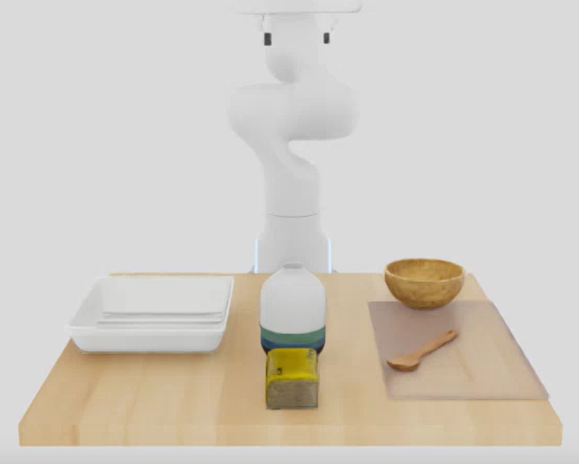
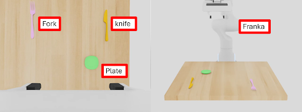
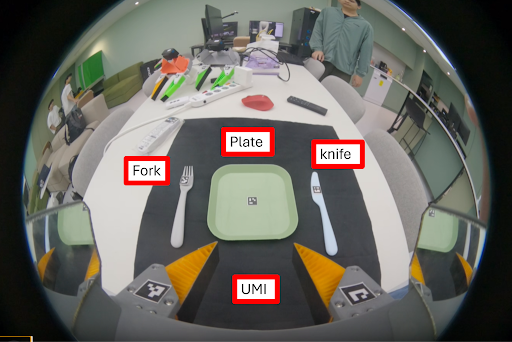
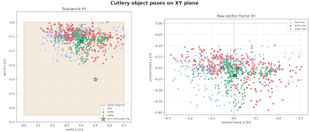
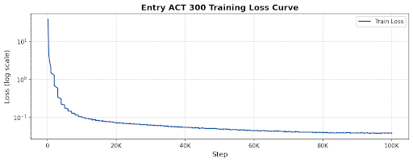
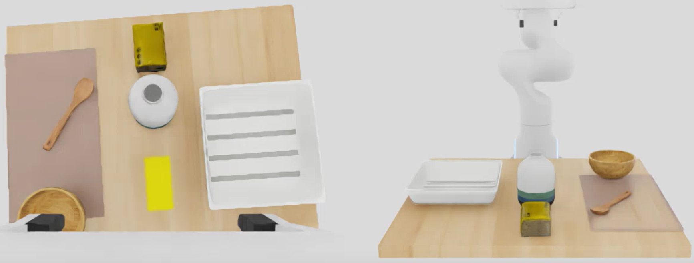
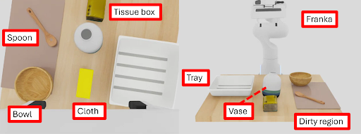
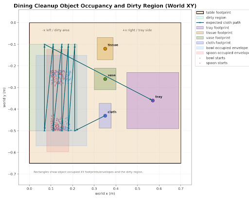
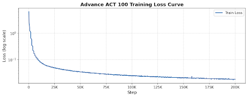
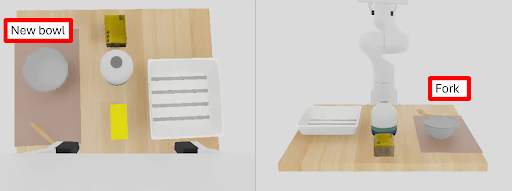

# AI Capstone: Sim-to-Real Imitation Learning for Robot Manipulation

An end-to-end Physical AI project that connects real-world UMI data collection,
object-pose reconstruction, Isaac Lab expert generation, LeRobot policy training,
and simulation rollout evaluation.



The project studies two levels of robot manipulation:

| Level | Task | Main challenge | Best reported rollout result |
|---|---|---|---|
| Entry | Cutlery Arrangement | Grasp thin utensils and place them on the correct sides of a plate | 67.7% with ACT at the 60k checkpoint |
| Advanced | Dining Cleanup | Clear tableware, wipe a surface, return the cloth, and protect nearby objects | 76.7% with ACT in the original scene |

> **Platform:** Linux with an Nvidia GPU. Isaac Lab runs in Docker; LeRobot
> training runs on the host.

Project reports:

- [Entry-level final report](docs/dining_cleanup/Team13_project_entry_report.pdf)
- [Advanced-level final report](docs/dining_cleanup/Team13_project_advanced_report.pdf)
- [Advanced project proposal](docs/dining_cleanup/advanced_proposal.md)

For detailed environment setup and commands, start with
[Getting Started](docs/getting_started.md).

## End-to-End Method

1. **Collect and reconstruct the scene.** Record the Entry-level dining setup
   with UMI, process the videos with SLAM, and recover object poses.
2. **Build the simulator task.** Recreate the table, objects, targets, and Franka
   robot in Isaac Lab. The Advanced task is designed and collected entirely in
   simulation.
3. **Generate robot demonstrations.** Use task-specific finite-state-machine
   (FSM) experts to produce robot-compatible trajectories and keep only
   successful episodes.
4. **Train imitation policies.** Store demonstrations in LeRobot format and train
   ACT, Diffusion Policy, and SmolVLA.
5. **Evaluate closed-loop rollouts.** Measure overall completion, subtask
   success, safety constraints, and generalization under scene changes.

Human motion is used to recover scene configurations rather than being replayed
directly on the robot. The FSM converts each reconstructed layout into a
collision-aware Franka trajectory, reducing problems caused by tracking noise,
human/robot kinematic differences, and sim-to-real mismatch.

## Entry Level: Cutlery Arrangement

**Task ID:** `HCIS-CutleryArrangement-SingleArm-v0`

The Entry-level task starts with a fork and knife at varied poses around a fixed
plate. A single Franka arm must:

1. grasp the knife and place it on the right side of the plate;
2. grasp the fork and place it on the left side of the plate;
3. keep both utensils close to the plate and at a physically valid table height;
4. finish before the rollout horizon.



This task tests visual grounding of small objects, stable grasping of thin
cutlery, side-aware placement, and robustness to initial-pose variation.

### Entry-Level Data and FSM

The real dining scene was first recorded with UMI. The recovered object poses
were then used to initialize Isaac Lab scenes for FSM demonstration generation.



The expert executes seven phases for each utensil: hover, approach, grasp, lift,
move above the target, lower/release, and retreat. We refined the baseline FSM
in four ways:

- tuned hover, lift, and release heights for thin objects;
- recaptured the end-effector start pose before each utensil to smooth both
  pick-and-place trajectories;
- locked the end-effector XY position during lifting to avoid target drift;
- added phase-dependent DART-style offsets that decay to zero, creating
  drift-then-correct recovery trajectories.

Successful demonstrations must also pass distance, correct-side, and height
checks. Failed grasps, dropped objects, invalid placements, and incomplete
episodes are excluded from training.

| Object-pose set | Scene configurations | Successful FSM episodes | Generation success |
|---|---:|---:|---:|
| Original UMI poses | 84 | 62 | 73.8% |
| Augmented poses | 300 | 221 | 73.7% |

The 300-pose set does not increase the FSM success rate, but it provides many
more valid demonstrations and a wider set of initial layouts.



### Entry-Level Training and Results

ACT, Diffusion Policy, and SmolVLA were trained through LeRobot. The main ACT
configuration uses a chunk size of 100, executes one action before replanning,
and applies temporal ensembling with coefficient `0.01`. Diffusion Policy uses
a horizon of 16, eight executed actions, and two observation steps.



The report evaluates each checkpoint over 30 rollout episodes:

| Experiment | Policy | Pose set | Training steps | Reported success |
|---|---|---:|---:|---:|
| Dataset scale | ACT | 84 | 100k | 43.3% |
| Dataset scale / policy comparison | ACT | 300 | 100k | 43.3% |
| Policy comparison | Diffusion Policy | 300 | 100k | 36.7% |
| Policy comparison | SmolVLA | 300 | 60k | 60.0% |
| Checkpoint selection | ACT | 300 | 60k | **67.7%** |
| Checkpoint selection | ACT | 300 | 80k | 26.7% |

Key observations:

- Increasing from 84 to 300 poses did not improve the 100k ACT checkpoint,
  suggesting that layout count alone did not create enough trajectory diversity.
- SmolVLA produced the strongest architecture-comparison result and sometimes
  recovered from failed or overlapping grasps not represented in the FSM data.
- The 60k ACT checkpoint outperformed the 80k and 100k checkpoints, showing
  that lower training loss or longer training does not necessarily improve
  closed-loop task success.

Implementation:

- [Cutlery task configuration](packages/simulator/src/simulator/tasks/cutlery_arrangement/cutlery_arrangement_env_cfg.py)
- [Cutlery FSM expert](packages/simulator/src/simulator/datagen/state_machine/cutlery_arrangement.py)
- [Raw-pose generator](scripts/generate_cutlery_raw_poses.py)

## Advanced Level: Dining Cleanup

**Task ID:** `LeIsaac-HCIS-DiningCleanup-SingleArm-v0`

**Compatibility alias:** `HCIS-DiningCleanup-SingleArm-v0`

Dining Cleanup extends pick-and-place into a long-horizon household task. The
scene contains a bowl and spoon to clear, a tray as the placement target, a
cloth as the cleaning tool, a dirty table region, and a tissue box and vase that
must not be disturbed.



*Dining Cleanup scene from the top and robot-side cameras.*



The robot must complete the stages in order:

1. move the bowl into the tray;
2. move the spoon into the tray;
3. pick up the cloth and sweep the predefined dirty region;
4. return the cloth to the tray;
5. keep the tray, tissue box, and vase within their allowed displacement and
   avoid dropping objects from the table.

The task is advanced because it combines dependent stages, role-aware object
handling, object-specific grasps, continuous surface coverage, and safety
constraints in one rollout.

### Advanced FSM and Evaluation Method

The Advanced FSM uses object-specific grasp heights, an edge-biased bowl grasp,
and separate tray drop offsets for the bowl and spoon. After clearing the
tableware, it acquires the cloth and follows multiple sweeping lanes across a
discretized dirty region.



Wiped cells accumulate only while the cloth is within 4 cm of the tabletop. An
episode is successful only when all required checks pass:

| Criterion | Requirement |
|---|---|
| Tableware clearing | Bowl and spoon are both placed in the tray |
| Surface wiping | At least 70% of the target dirty region is covered |
| Tool return | The cloth is returned to the tray after wiping |
| Scene safety | Tray, tissue box, and vase remain within their displacement limits |
| Completion | Objects remain on the table and the full task timeline finishes |

The training set contains **77 successful demonstrations from 100 generated
object-pose configurations**. ACT, Diffusion Policy, and SmolVLA use the same
77 episodes, and the Advanced experiments use a 200k-step training budget
because each cleanup trajectory is substantially longer than an Entry-level
trajectory.



### Advanced Policy Results

Each policy is evaluated over 30 rollouts in the original fixed-spoon scene:

| Metric | ACT | Diffusion Policy | SmolVLA |
|---|---:|---:|---:|
| Overall success | **76.7%** | 0.0% | 0.0% |
| Bowl placement | 86.7% | 66.7% | 0.0% |
| Spoon placement | 86.7% | 20.0% | 0.0% |
| Average wipe coverage | 52.1% | 5.7% | 0.0% |
| Coverage pass (≥70%) | 76.7% | 16.7% | 0.0% |
| Cloth returned | 76.7% | 6.7% | 0.0% |
| No collision | 100.0% | 60.0% | 100.0% |

ACT performs best on the structured, repetitive expert sequence. Diffusion
Policy often misses the spoon and then enters states outside the demonstration
distribution. SmolVLA commonly fails at the first bowl grasp and does not
recover in this longer multi-stage task.

### Advanced Generalization Results

The same trained ACT policy is also evaluated under two distribution shifts:
random spoon orientation and replacement USD assets.



| Metric | Original scene | Random spoon direction | Changed USD assets |
|---|---:|---:|---:|
| Overall success | **76.7%** | 43.3% | 3.3% |
| Bowl placement | 86.7% | 86.7% | 50.0% |
| Spoon/fork placement | 86.7% | 50.0% | 44.4% |
| Average wipe coverage | 52.1% | 26.9% | 14.7% |
| Coverage pass (≥70%) | 76.7% | 50.0% | 5.6% |
| Cloth returned | 76.7% | 46.7% | 5.6% |
| No collision | 100.0% | 90.0% | 100.0% |

Random orientation mainly hurts spoon grasping because the learned gripper
approach does not reliably rotate with the utensil. Replacement assets cause a
larger geometry shift: the curved bowl is harder to grasp, and an early failure
propagates through the remaining cleanup sequence.

Implementation and reproduction:

- [Dining Cleanup implementation guide](docs/dining_cleanup/README.md)
- [Evaluation configurations](docs/dining_cleanup/evaluation_configs.md)
- [Dataset and object-pose generation](docs/dining_cleanup/dataset_generation.md)
- [Environment configuration](packages/simulator/src/simulator/tasks/dining_cleanup/dining_cleanup_env_cfg.py)
- [Dining Cleanup FSM](packages/simulator/src/simulator/datagen/state_machine/dining_cleanup.py)

## Running the Pipeline

### 1. Install the UMI Processing Environment

```bash
uv sync --package umi
source .venv/bin/activate
```

Log in to Hugging Face and set the username used by the project commands:

```bash
hf auth login --token <YOUR_HF_TOKEN>
export HF_USER=<your-huggingface-username>
```

### 2. Process Human Demonstrations

Place each recording session under:

```text
data/YYYYMMDD-taskname/raw_videos/
```

Run a verification config before the full dataset build because the SLAM stage
is sensitive to mapping-video quality:

```bash
uv run umi run-slam-pipeline \
  umi_pipeline_configs/verify_pipeline_C2.yaml \
  --session-dir <demo_directory_name>
```

After verification succeeds, select the matching build config:

```bash
uv run umi run-slam-pipeline \
  umi_pipeline_configs/build_dataset_C2.yaml \
  --session-dir <demo_directory_name> \
  --task dining_room
```

The repository also contains `C6` and `C9` verification/build variants. See
[UMI Pipeline](docs/umi_pipeline.md) for the full workflow and troubleshooting.

### 3. Generate Simulation Demonstrations

Isaac Lab requires Linux, Docker, a compatible Nvidia driver, and a visible
GPU. Review the cache mount and Hugging Face settings in the wrapper before
running:

```bash
bash run_datagen_adv-v1.sh
```

For direct task-specific commands and object-pose options, see
[Synthetic Data Generation](docs/synthetic_data_generation.md) and the
[Dining Cleanup dataset guide](docs/dining_cleanup/dataset_generation.md).

### 4. Train a LeRobot Policy

Training runs on the host and produces a policy checkpoint from a generated
LeRobot dataset:

```bash
bash run_training_v5.sh
```

See [LeRobot Training](docs/lerobot_training.md) for ACT, Diffusion Policy,
multi-GPU, checkpoint, and dataset options.

### 5. Evaluate a Policy

Rollout loads a trained policy into Isaac Lab and evaluates it in closed loop:

```bash
bash rollout_entry.sh
bash rollout_advance_act.sh
# or
bash rollout_advance_diffusion.sh
```

See [LeRobot Rollout](docs/lerobot_rollout.md) for the complete command
reference.

## Repository Map

```text
packages/simulator/src/simulator/
├── tasks/                         # task registration and environment configs
├── datagen/state_machine/         # FSM expert policies
└── utils/object_poses_loader.py   # UMI-style pose loading

scripts/
├── datagen/generate.py            # FSM demonstration generation
├── rollout.py                     # policy evaluation
└── generate_*_object_poses.py     # pose-set generation

configs/dining_cleanup/            # Advanced evaluation variants
data/                              # object-pose sets and visualizations
docs/                              # setup, training, rollout, and task guides
```

## Documentation

| Document | Description |
|---|---|
| [Getting Started](docs/getting_started.md) | End-to-end environment and pipeline walkthrough |
| [Developer Introduction](docs/dev/introduction.md) | Repository layout and execution environments |
| [UMI Pipeline](docs/umi_pipeline.md) | Human demonstration and SLAM processing |
| [Synthetic Data Generation](docs/synthetic_data_generation.md) | Isaac Lab FSM dataset generation |
| [LeRobot Training](docs/lerobot_training.md) | Policy training and checkpoint management |
| [LeRobot Rollout](docs/lerobot_rollout.md) | Policy evaluation in simulation |
| [LeRobot Dataset Visualizer](docs/lerobot_dataset_visualizer.md) | Inspecting LeRobot datasets |
| [LeRobot Checkpoint Format](docs/lerobot-model-format.md) | Understanding policy checkpoint structure |
| [Isaac Lab + LeIsaac Tutorial](docs/isaaclab_leisaac_tutorial.md) | Simulator and task configuration |
| [Standalone Environment Export](docs/standalone_env_config_export.md) | Exporting task configurations |
| [Dining Cleanup Guide](docs/dining_cleanup/README.md) | Advanced task design and reproduction |
| [Dining Cleanup Evaluation Configs](docs/dining_cleanup/evaluation_configs.md) | Fixed yaw, random yaw, and asset-shift settings |
| [Dining Cleanup Dataset Generation](docs/dining_cleanup/dataset_generation.md) | Pose splits and layout visualization |

## License

MIT — see [LICENSE](LICENSE).
